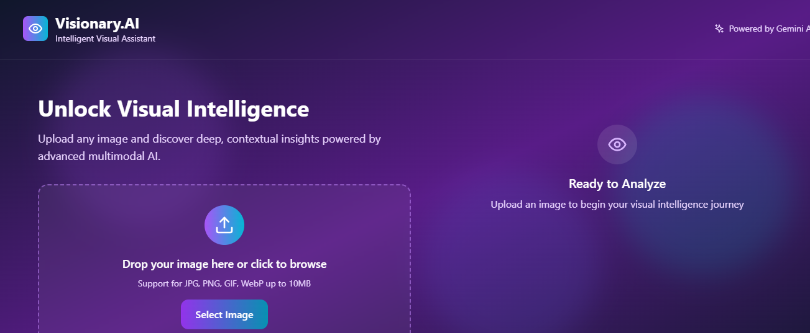

# 👁️ Visionary.AI – See More Than Meets the Eye

[](#license)
[](#tech-stack)
[](#deployment)
[](#api-integration)

> **Visionary.AI** is a next-gen visual assistant powered by Gemini Vision API. Upload an image, ask questions, and receive deep contextual insights in real-time. From document interpretation to object recognition, **Visionary.AI** helps you see, know, and act—smarter.

---

## 🚀 Live Demo


🔗 [Click to Try Visionary.AI](#)
🎥 [Watch Demo Video](#)

---

## 📸 Key Features

* 🧠 **Multimodal Intelligence**: Understands images and responds to custom queries using Gemini's Vision API.
* 📄 **Context Extraction**: Summarizes documents, posters, charts, or scenes.
* 🎤 **Voice Input & Output**: Ask questions via mic and get AI answers in speech.
* 🖼️ **Smart Upload UI**: Drag and drop images, annotate, or use webcam.
* 🧾 **Response Types**: Summaries, bullet points, key details, and follow-ups.
* 🌙 **Dark Mode & Theming**: Switch between light/dark gradients dynamically.
* 🕓 **History Log**: See past queries and revisit old results (local cache).
* ⚡ **Responsive & Mobile-Ready**: Works seamlessly across devices.

---

## 🛠️ Tech Stack

| Layer          | Tools                                            |
| -------------- | ------------------------------------------------ |
| **Frontend**   | React.js, Tailwind CSS, Redux Toolkit            |
| **AI APIs**    | Gemini Vision (Google AI Studio), Web Speech API |
| **Animations** | Framer Motion, Lottie                            |
| **Deployment** | Azure Static Web Apps / Firebase Hosting         |
| **Voice**      | Web Speech (Speech-to-Text + TTS)                |
| **State**      | Redux or Recoil                                  |

---

## 📂 Project Structure

```
/src
  /components
    - UploadImage.jsx
    - OutputPanel.jsx
    - VoiceInput.jsx
    - Loader.jsx
  /api
    - gemini.js
  /redux
    - store.js
  /utils
    - promptBuilder.js
App.jsx
index.js
```

---

## 🧪 How It Works

1. 📄 User uploads an image or uses webcam input
2. ✍️ Optional: User types a query (e.g. “What’s in this prescription image?”)
3. ⚙️ Frontend builds prompt and sends to Gemini Vision API
4. 🧠 Gemini returns contextual result → displayed in animated output panel
5. 🔀 User can ask follow-up or switch to voice interaction

---

## 🔐 API Integration

```js
// Example API call
const response = await geminiVision.generate({
  image: uploadedImage,
  prompt: "Summarize the content of this image",
});
```

> *Use environment variable `.env` for API key*
> `VITE_GEMINI_API_KEY=your_key_here`

---

## ✨ Screenshots

| Upload Image                           | Gemini Response                            |
| -------------------------------------- | ------------------------------------------ |
|  |  |

---

## 📦 Installation

```bash
git clone https://github.com/your-username/visionary-ai.git
cd visionary-ai
npm install
npm run dev
```

---

## 🧐 Use Cases

* ✏️ Students analyzing handwritten notes
* 🧾 Professionals summarizing documents/posters
* 👃 Accessibility for visually impaired (speech response)
* 🍭 Image-based product search & insight

---

## 🤩 Future Enhancements

* 🔍 OCR overlay highlights on image
* 🌍 Multilingual voice translation
* 🧠 Model comparison (Gemini vs GPT-4 Vision)
* 🧾 Export response to PDF/Notion

---

## 🙌 Contributors

* 💡 [Devanshi Awasthi](https://github.com/DevanshiA29) – Project Lead, Frontend Dev, AI Integrator

Want to contribute? Feel free to fork, star, and PR! ⭐

---

## 📜 License

MIT License © 2025 Devanshi Awasthi

---

## 📢 Feedback

If you like this project, leave a ⭐ on GitHub!
For feature requests or bugs, [open an issue](#)!
